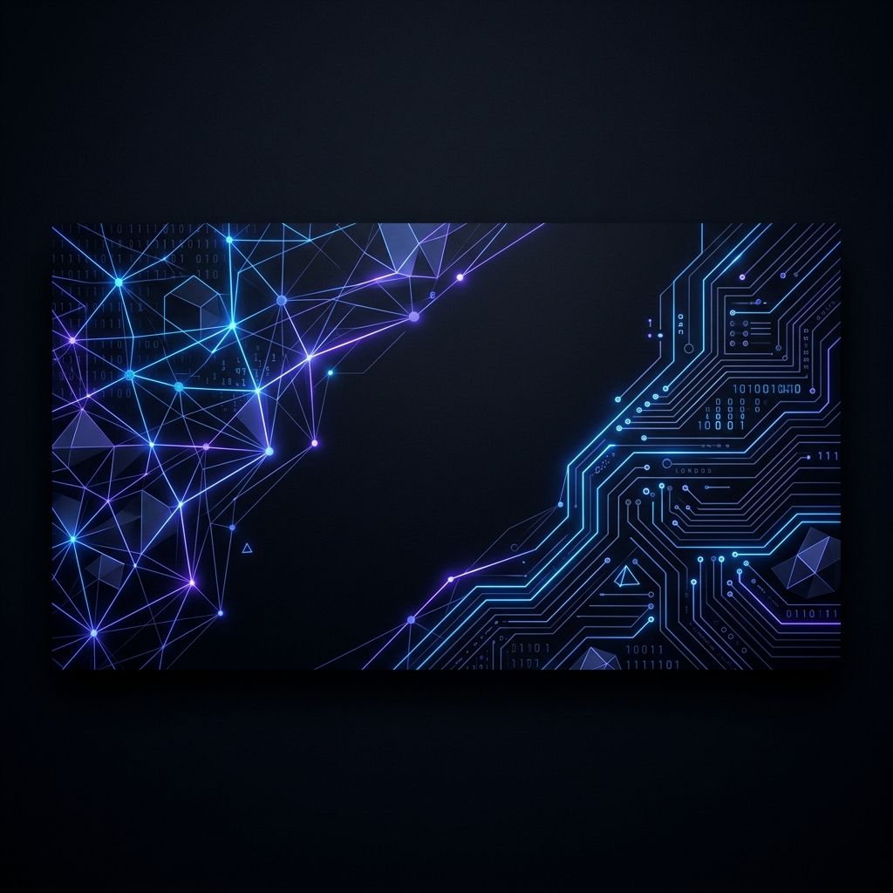

  
  
   

  ### ✍️ Developer Quote of the Day
  

   

  

  ---

  # 💫 About Me
  
  I'm **Kaustubh Pathak**, a 23-year old technical enthusiast. 
  Passionate about **Problem Solving (Data Structures & Algorithms)** and **Development**.
  
  <a href="https://kaustubh0777.netlify.app/"><b>Check out my Portfolio 🚀</b></a>

  ---

  ## 🌐 Socials
  
  

    
    
  

  ---

  # 💻 Tech Stack
  
  

    
    
    
    
    
    
    
    
    
    
    
    
    
    
  

  ---

  # 📊 GitHub Stats
  
  

    
     
    
     
    
  

   

  ## 🏆 GitHub Trophies
  

    
  

